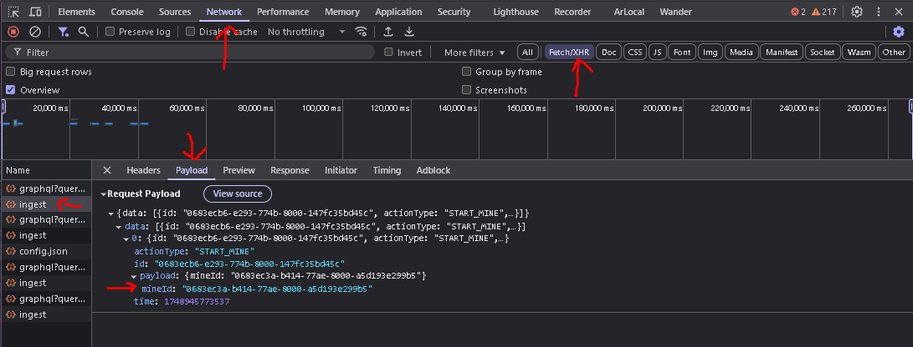
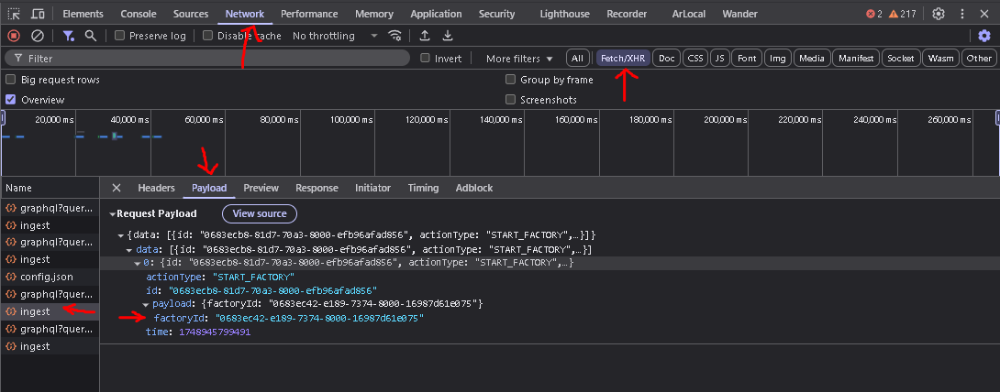
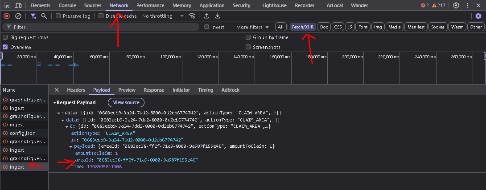

<div align="center">

# Craft World Auto Bot by SCxVBS

**Automated Bot for Mining & Claim in Craft World with Multi-ID Support.**

<p>
  
  
  
  
</p>

<p>
  <a href="https://t.me/scxvbs" target="_blank">
    
  </a>
  <a href="https://whatsapp.com/channel/0029VbAR1YL5EjxqhRhOzT3x" target="_blank">
    
  </a>
</p>

</div>

---

> **Notice:** This script is designed for educational purposes and to automate repetitive tasks. Use it wisely and understand the risks.

## ✨ Key Features

-   **🤖 Full Automation**: Automatically runs `start` and `claim` cycles for all your assets.
-   **⚡ Multi-ID Support**: Designed to efficiently manage multiple `mineIds`, `factoryIds`, and `areaIds` in a single account.
-   **⚙️ Efficient & Parallel**: Uses `Promise.allSettled` to run all tasks simultaneously, saving time and resources.
-   **🔧 Easy Configuration**: Simply set up all your IDs in one easy-to-understand `config.json` file.
-   **📊 Informative Logging**: Provides clear, colored logs for every action, making monitoring easy.

## 🛠️ Tech Stack

<p>
  
  
  
</p>

## 🚀 Installation & Usage Guide

Make sure you have [Node.js](https://nodejs.org/) (version 16 or higher is recommended) and [Git](https://git-scm.com/) installed.

1.  **Clone This Repository**
    Open your terminal or command prompt and run the following command:
    ```bash
    git clone https://github.com/SCxVBS/Craft-World-Auto-Bot.git
    ```

2.  **Navigate to the Project Directory**
    ```bash
    cd Craft-World-Auto-Bot
    ```

3.  **Install Dependencies**
    Run this command to install all the necessary packages for the bot.
    ```bash
    npm install
    ```

4.  **Create Private Key File**
    Create a new file named `pk.txt` in the project folder, then fill it with your wallet's *private key*.

5.  **Configure Your Assets**
    - Open the `config.json` file.
    - Modify its content according to the `mineIds`, `factoryIds`, and `areaIds` you own.
    
    **Example `config.json`:**
    ```json
    {
      "name": "My Craft World Account",
      "mineIds": [
        "mine-id-1",
        "mine-id-2"
      ],
      "factoryIds": [
        "factory-id-1",
        "factory-id-2",
        "factory-id-3"
      ],
      "areaIds": [
        "area-id-1"
      ]
    }
    ```

6.  **How to Find Your Asset IDs**
    To get the IDs, you need to use the *Developer Tools* feature in your browser.
    -   Open the Craft World website in your browser (Chrome/Firefox).
    -   Right-click anywhere on the page, then select **"Inspect"** or press the **F12** key.
    -   Select the **"Network"** tab.
    -   Perform an action in the game (e.g., start a mine). A request named `ingest` will appear. Click on that request.
    -   In the panel that appears, look for the **"Payload"** or **"Request"** tab. You will find the required ID there.

    **A. Finding `mineId`**
    Perform an action related to a mine (start/claim) to find the `mineId`.
    

    **B. Finding `factoryId`**
    Perform an action related to a factory (start) to find the `factoryId`.
    

    **C. Finding `areaId`**
    Perform an action related to an area (claim) to find the `areaId`.
    

7.  **Run the Bot**
    After all configurations are complete, run the bot with the command:
    ```bash
    node index.js
    ```
    The bot will start running, and you will see the activity logs in your terminal.

## 📂 File Structure


Craft-World-Auto-Bot/
├── 1.jpg               # Guide image for Mine ID
├── 2.jpg               # Guide image for Factory ID
├── 3.jpg               # Guide image for Area ID
├── node_modules/       # Dependency folder (auto-generated)
├── auth.js             # Module for authentication (web3 login)
├── config.json         # Main configuration file for all your IDs
├── index.js            # Main script to run the bot
├── package.json        # Project information and dependency list
├── pk.txt              # File to store your private key (Must be created manually)
└── README.md           # The file you are currently reading


## ⚠️ Disclaimer

The author (SCxVBS) is not responsible for any losses, asset damages, or account bans that may occur from using this script. You are fully responsible for your own actions. **Do With Your Own Risk (DWYOR).**

---

<div align="center">
  Made with ❤️ by SCxVBS
</div>
